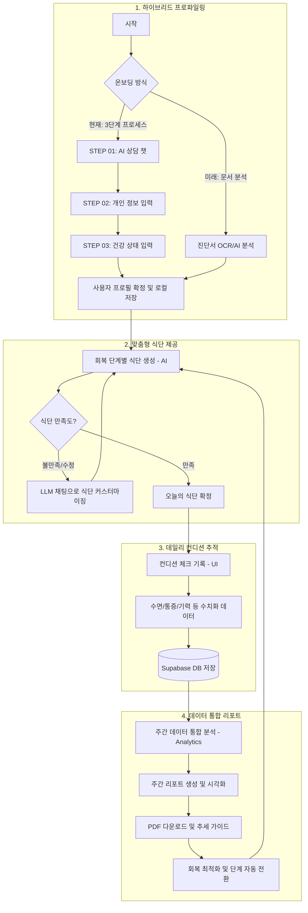

# 🔄 시스템 워크플로우 (System Flowchart)

본 문서는 수술 후 회복 관리 서비스의 실제 구현된 데이터 흐름과 사용자 여정을 시각화한 플로우차트입니다.

## 1. 전체 프로세스 플로우

## 2. 주요 단계별 상세 설명

### 🟢 1단계: 하이브리드 사용자 프로파일링
*   **현재 구현**: AI 상담 챗(Step 1)을 통해 기초 정보를 얻고, 이후 상세 폼(Step 2, 3)을 통해 정밀한 수술 정보와 기저질환, 알러지 데이터를 확정합니다. 확정된 프로필은 `localStorage`에 보관됩니다.
*   **추후 계획**: 진단서 OCR 분석을 통해 수동 입력 과정을 대폭 자동화할 예정입니다.

### 🍱 2단계: 개인형 맞춤 식단 및 커스터마이징
*   **AI 생성**: `lib/ai/meal-ai.ts` 엔진을 사용하여 프로필 기반의 5끼 식단을 생성합니다.
*   **채팅 수정**: 사용자는 `MealChat` 인터페이스를 통해 "너무 느끼해", "이 재료 빼줘" 등의 자연어로 식단을 즉시 수정할 수 있습니다.

### 📝 3단계: 데일리 컨디션 및 데이터 누적
*   **트래킹**: `symptom-check` 페이지에서 사용자의 통증, 기력, 수면(예정), 소화 상태를 0-10 척도로 수치화하여 기록합니다.
*   **영속성**: 기록된 데이터는 Supabase의 `daily_logs` 테이블에 영구 저장됩니다.

### 📈 4단계: 통합 주간 리포트 및 인사이트
*   **분석**: `lib/utils/analytics.ts`를 통해 한 주간의 통증/기력 변화량을 계산합니다.
*   **제공**: Recharts를 활용한 시각화 차트를 제공하며, 필요시 PDF 리포트로 출력하여 의료진 상담용으로 활용할 수 있습니다.

---
*최종 업데이트 날짜: 2026-01-26*
