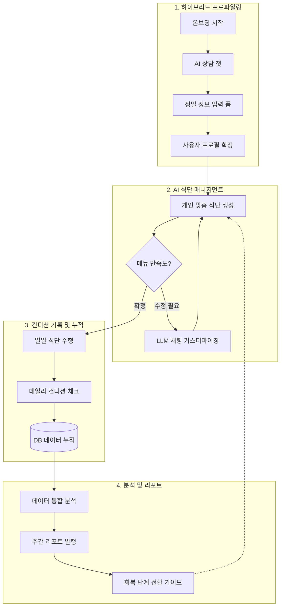

# 📊 시스템 워크플로우 - 표준형 (Standard Flow)

본 문서는 서비스의 주요 기능적 구성 요소와 데이터 순환 구조를 적절한 상세 수준으로 정리한 표준형 워크플로우입니다.

## 🔄 워크플로우 다이어그램

## 📋 단계별 핵심 요약

1.  **하이브리드 프로파일링**: AI와의 대화를 통해 초기 맥락을 파악하고, 수술 종류 및 기저질환 등은 정교한 폼을 통해 입력받아 신뢰도 높은 데이터를 구축합니다.
2.  **AI 식단 매니지먼트**: 임상 가이드라인과 개인 선호를 반영한 식단을 생성합니다. 실시간 채팅 수정을 통해 사용자 주방 상황이나 기호에 맞게 유연하게 대응합니다.
3.  **컨디션 기록 및 누적**: 매일의 회복 지표(통증, 기력, 수면 등)를 데이터화하여 저장합니다. 이는 단순 기록을 넘어 회복의 객관적 증거가 됩니다.
4.  **분석 및 리포트**: 누적된 데이터를 바탕으로 주간 트렌드를 시각화하고, 회복 속도에 따라 다음 단계(예: 미음 → 죽)로의 안전한 전환 시점을 추천합니다.

---
*최종 업데이트 날짜: 2026-01-26*
