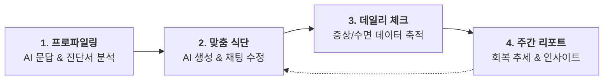

# 📋 서비스 요약 프로세스 (Service Overview)

본 문서는 수술 후 회복 관리 서비스의 핵심 여정을 한눈에 파악할 수 있도록 요약한 플로우차트입니다.

## 🚀 코어 사용자 여정 (Core Journey)

## 🔍 핵심 기능 요약

| 단계               | 주요 기능          | 설명                                                        |
| :----------------- | :----------------- | :---------------------------------------------------------- |
| **1. 프로파일링**  | 하이브리드 온보딩  | AI 채팅 및 진단서(OCR)를 통한 개인별 수술/건강 상태 분석    |
| **2. 맞춤 식단**   | AI 생성 & 최적화   | 회복 단계별 식단 제안 및 LLM 채팅을 통한 실시간 메뉴 수정   |
| **3. 데일리 체크** | 컨디션 데이터 추적 | 매일 통증, 기력, 수면 상태 등을 기록하여 회복 데이터 축적   |
| **4. 주간 리포트** | 통합 분석 리포트   | 누적 데이터를 분석하여 주간 회복 추세 시각화 및 가이드 제공 |

---
*최종 업데이트 날짜: 2026-01-26*
