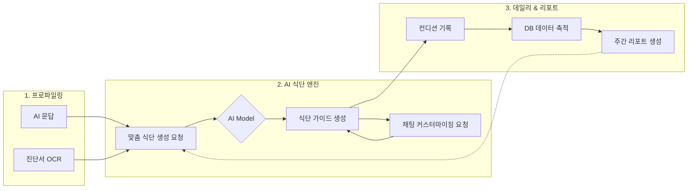

# 프로젝트 발표 요약: 환자 맞춤형 AI 영양 관리 파트너

본 문서는 프로젝트의 기술적 아키텍처, 개발 과정에서의 문제 해결, 그리고 비즈니스적 비전을 정리한 발표용 요약 가이드입니다.

---

## 1. 프로젝트 개요 및 아키텍처 (The Foundation)

### 핵심 컨셉
"기력 없는 환자를 위한 가장 쉽고 전문적인 AI 식단 가이드"

### 기술 스택 (Tech Stack)
*   **Frontend**: `Next.js 16` , `React 19`, `TypeScript`
*   **UI/UX**: `TailwindCSS 4`, `Shadcn UI`
*   **Backend & DB**: `Supabase` (Auth, PostgreSQL, Storage)
*   **AI Engine**: `LLM Integration` (OpenAI GPT-5.2, GPT-5-mini, Google Gemini 2.5 Flash, Groq Llama 3)

### 아키텍처 특징: "1인 스타트업을 위한 고효율 확장성(Cost-Effective Scalability)"
*   **Serverless First (Vercel & Supabase)**: 1인 스타트업의 제약(시간·자본·인력)을 극복하기 위한 핵심 전략입니다.
    *   **운영 오버헤드 제로**: 인프라 관리를 플랫폼에 위임했습니다. 비즈니스 로직과 UX에만 집중할 수 있는 환경을 구축했습니다.
    *   **압도적 비용 절감**: 초기 비용 0원. 사용량 기반 과금으로 비즈니스 리스크를 최소화했습니다.
    *   **엔터프라이즈급 성능**: Vercel과 Supabase를 활용하여 1인 개발 서비스임에도 고성능·고가용성 아키텍처를 확보했습니다.
*   **Smart Fallback AI (Multi-Model Reliability)**: 1인 개발자가 API 장애에 실시간으로 대응하기 어렵다는 점을 고려하여, 특정 AI 모델(OpenAI) 장애 시 자동으로 예비 모델(Gemini, Groq)로 전환되는 '무중단 자동 복구' 시스템을 구축했습니다. 이를 통해 운영 리소스를 최소화하면서도 엔터프라이즈급 안정성을 확보했습니다.

#### 🔄 시스템 워크플로우 (Architecture Flow)

---

## 2. 서비스 고도화 및 문제 해결 (The Evolution)

### 사용자 경험(UX) 최적화
*   **Single-Step Interaction**: 초기 챗봇의 과도한 질문 방식을 개선하여, 한 번에 하나의 정보를 확인하는 몰입형 온보딩 시스템을 구축했습니다.
*   **환자 친화적 디자인**: 타이핑을 최소화하고 직관적인 버튼 선택 위주의 UI를 제공하여 수술 후 기력이 저하된 환자도 쉽게 사용할 수 있도록 설계했습니다.

### AI 모델 최적화: 환각(Hallucination) 제어
*   **Clinical Guidelines 주입**: ESPEN(유럽임상영양대사학회) 및 ERAS(수술 후 빠른 회복 프로그램) 가이드라인을 AI 프롬프트에 내재화하여 의학적 근거가 있는 식단을 생성합니다.
*   **JSON Schema Enforcement**: 출력 형식을 엄격히 제한하여 데이터 정합성을 확보하고 프론트엔드 렌더링 오류를 방지했습니다.

---

## 3. 시연 및 사용자 여정 (The Experience)

### 주요 사용자 흐름 (Persona: 수술 후 회복 환자)
1.  **건강 상태 체크**: 매일 아침 간단한 선택지로 컨디션 기록.
2.  **맞춤형 식단 추천**: 회복 단계(유동식, 연식, 일반식)에 따른 영급별 식단 확인.
3.  **영양 인사이트**: `Recharts` 기반 대시보드를 통해 단백질, 칼로리 등 권장 섭취량 대비 현재 상태 시각화.
4.  **주간 리포트**: 한 주간의 섭취 데이터를 AI가 분석하여 건강 조언 및 리포트 자동 생성.

---

## 4. 기술적 한계 및 회고 (The Lesson)

*   **일관성 문제**: LLM의 확률적 특성으로 인한 응답 변동성을 `Temperature` 최적화 및 시스템 프롬프트 고도화를 통해 해결하려고 노력했습니다.
*   **데이터 검증**: 실제 의료 데이터와의 연동이 서비스의 핵심이며, 이를 위해 데이터 정규화(`normalizeMeals`) 로직을 지속적으로 개선하고 있습니다.

---

## 5. 향후 발전 방향 (The Vision)

### Roadmap
*   **Short-term**: OCR 기능을 통한 실제 음식 사진 인식 및 영양 성분 자동 추출 기능 추가.
*   **Mid-term**: RAG(검색 증강 생성) 기술을 활용하여 최신 의학 논문 기반의 실시간 상담 기능 고도화.
*   **Long-term**: 병원 EMR(전문의무기록) 연동을 통한 B2B2C 모델 확장 및 의사용 환자 모니터링 대시보드 제공.
